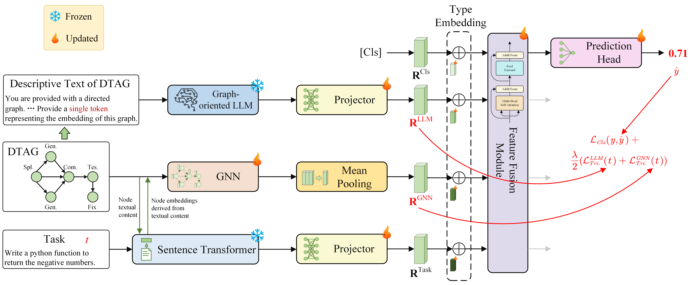

# GLOW: Graph-Language Co-Reasoning for Agentic Workflow Performance Prediction #

Official Implementation of "GLOW: Graph-Language Co-Reasoning for Agentic Workflow Performance Prediction"



## 🚀 Getting Started

### 1. Set Up the Environment.
💻 **Software Requirements**:
  - Python: 3.11.13
  - CUDA: 12.1

📦 **Install dependencies**:
 
 Install from ```requirements.txt```
```
 conda install --yes --file requirements.txt # You may need to downgrade the torch using pip to match the CUDA version
```

### 2. Download Pretrained Models
Download the following pretrained models from Hugging Face:

- LLM: [Qwen3-1.7B](https://huggingface.co/Qwen/Qwen3-1.7B/tree/main)

```
   ├── Qwen3-1.7B
   │ ├── config.json
   │ ├── generation_config.json
   │ ├── LICENSE
   │ ├── merges.txt
   │ ├── model-00001-of-00002.safetensors
   │ ├── model-00002-of-00002.safetensors
   │ ├── model.safetensors.index.json
   │ ├── tokenizer.json
   │ ├── tokenizer_config.json
   │ └── vocab.json
```


- Sentence-transformer: [all-MiniLM-L6-v2](https://huggingface.co/sentence-transformers/all-MiniLM-L6-v2/tree/main)

```
   ├── all-MiniLM-L6-v2
   │ ├── config.json
   │ ├── config_sentence_transformers.json
   │ ├── data_config.json
   │ ├── model.safetensors
   │ ├── modules.json
   │ ├── sentence_bert_config.json
   │ ├── special_tokens_map.json
   │ ├── tokenizer.json
   │ ├── tokenizer_config.json
   │ ├── train_script.py
   │ └── vocab.txt
```

### 3. Prepare Training and Testing Data

📥 Download Dataset

Download FLORA-Bench dataset from [here](https://huggingface.co/datasets/YuanshuoZhang/FLORA-Bench/tree/main) and place it in the `data` directory.

```
   ├── data
   │ ├── Coding-AF
   │ │ ├── test.jsonl
   │ │ ├── train.jsonl
   │ │ ├── val.jsonl
   │ ├── Coding-GD
   │ ├── Math-AF
   │ ├── Math-GD
   │ ├── Reason-AF
   │ └── Reason-GD
```

🛠️ Construct Pre-finetuning Data

To build the dataset for LLM Pre-finetuning, run the following command:
```
    python make_llm_prefinetuning_data.py --data_path ./data
```

⚙️ Arguments
- `--data_path`: Path to the dataset directory. 

This script processes the raw dataset and constructs formatted data suitable for LLM Pre-finetuning.


### 4. LLM Pre-Finetuning (Generating graph-oriented LLM)
#### ⚙️ Configuration

Open the script **`pre-finetuning_LLM.sh`** and set the following parameters:

1. **Visible GPUs**
   Modify the line:

   ```bash
   export CUDA_VISIBLE_DEVICES=0,1,2,3,4,5,6,7
   ```

   to match the GPUs you want to use.

2. **Model path** — specify your base LLM model, e.g:

   ```bash
   --model /home/weiguan/llmmodel/Qwen3-1.7B
   ```

3. **Dataset path** — specify the dataset path generated in the previous step, e.g:

   ```bash
   --dataset /home/weiguan/GLOW/data/prefinetuning.jsonl
   ```

#### 📈 Run

To pre-finetune the LLM using **LoRA**, simply run:

```bash
bash pre-finetuning_LLM.sh
```

This script automatically detects the number of available GPUs and launches distributed training.


#### 🧾 Output

All training logs and checkpoints will be saved in:

```
outputs/prefinetuning/
```

#### 🧠 Merge LoRA Weights with the Base Model
After pre-finetuning is completed, you need to merge the LoRA-adapted parameters with the base LLM checkpoint to obtain a standalone pretrained model.

Run the following Python script:

```
python combine_lora.py \
    --peft /home/weiguan/FLORA/outputs/prefinetuning/v0-20251015-105151/checkpoint-7300 \
    --checkpoint /home/weiguan/llmmodel/Qwen3-1.7B \
    --save_path /home/weiguan/FLORA/outputs/prefinetuning/base_model
```
**⚙️ Arguments**

| Argument       | Description                            | Example                                                              |
| -------------- | -------------------------------------- | ------------------------------------------------------------------------------ |
| `--peft`       | Path to the LoRA fine-tuned checkpoint | `/home/weiguan/FLORA/outputs/prefinetuning/v0-20251015-105151/checkpoint-7300` |
| `--checkpoint` | Path to the base LLM model             | `/home/weiguan/llmmodel/Qwen3-1.7B`                                            |
| `--save_path`  | Path to save the merged model          | `/home/weiguan/FLORA/outputs/prefinetuning/base_model`                         |

This script merges the LoRA adapter weights into the base model and saves a standalone model (graph-oriented LLM) ready for downstream training or inference.


 
### 5. Train and Evaluate
Run the following command (e.g., for the Coding-AF domain):

```
python train.py \
    --data_path ./data/Coding-AF \
    --llm_model_path /home/weiguan/FLORA/outputs/prefinetuning/base_model \
    --st_model_path /home/weiguan/llmmodel/all-MiniLM-L6-v2
```

**⚙️ Arguments**

| Argument                | Description                             | Example / Default                                      |
| ----------------------- | --------------------------------------- | ------------------------------------------------------ |
| `--data_path`           | Path to the root dataset directory      | `./data/Coding-AF`                                     |
| `--llm_model_path`      | Path to the pre-finetuned (merged) LLM model (graph-oriented LLM) | `/home/weiguan/FLORA/outputs/prefinetuning/base_model` |
| `--st_model_path`       | Path to the sentence transformer model  | `/home/weiguan/llmmodel/all-MiniLM-L6-v2`              |
| `--hidden_dim`          | Hidden layer dimension                  | `256`                                                  |
| `--n_gnn_layers`        | Number of GNN layers                    | `2`                                                    |
| `--dropout`             | Dropout rate                            | `0.2`                                                  |
| `--batch_size`          | Batch size for training and evaluation  | `512`                                                  |
| `--pretrain_batch_size` | Batch size for pretraining              | `64`                                                   |
| `--epochs`              | Number of training epochs               | `200`                                                  |
| `--lr`                  | Learning rate                           | `1e-4`                                                 |
| `--weight_decay`        | Weight decay for optimizer              | `1e-4`                                                 |
| `--seed`                | Random seed for reproducibility         | `42`                                                   |
| `--n_mlplayers`         | Number of MLP layers                    | `2`                                                    |
| `--patience`            | Early stopping patience                 | `30`                                                   |
| `--triplet_weight`      | Weight for triplet loss                 | `1`                                                    |
| `--margin`              | Triplet loss margin                     | `0.2`                                                    |
| `--pretrain_steps`      | Number of pretraining steps             | `1000`                                                 |
| `--eval_steps`          | Evaluation interval (in epochs)         | `1`                                                    |